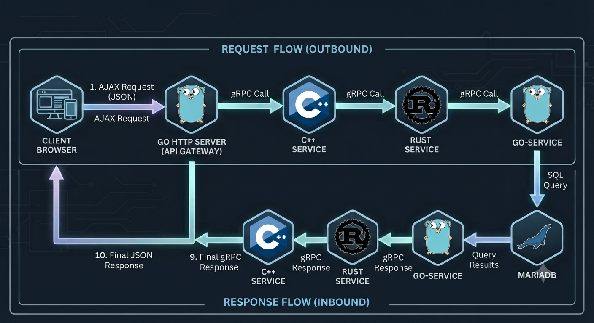

# gRPC-CrossLang-Communication-Demo
Minimal cross-language gRPC demo illustrating service-to-service communication between C++, Rust, and Go using Protobuf & FlatBuffers payloads.

	

## Tech Stack

## Architecture & Communication Flow

### Request & Response Sequence

> 1. **Initiation**: The client browser sends an **AJAX request** to the Golang HTTP Server (API Gateway).
> 2. **Gateway to C++ (Protobuf)**: The HTTP Server initiates a gRPC call exclusively to the **C++ Service** using **Protobuf**.
> 3. **C++ to Rust (FlatBuffers)**: The C++ Service delegates the call via gRPC to the **Rust Service** using **FlatBuffers**.
> 4. **Rust to Go (Protobuf)**: The Rust Service passes the request via gRPC to the **Go-Service** using **Protobuf**.
> 5. **Data Persistence**: The Go-Service fetches/persists data using SQL in **MariaDB**.
> 6. **Return Path**: The response travels backward along the chain: 
>   `MariaDB` ➔ `Go-Service` (Protobuf) ➔ `Rust Service` (FlatBuffers) ➔ `C++ Service` (Protobuf) ➔ `Go HTTP Server` ➔ `Client Browser (AJAX)`.